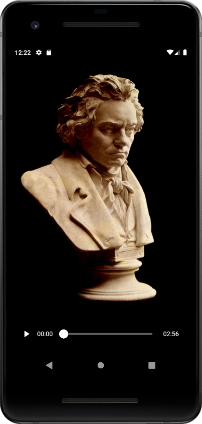

# Beethoven Fur Elise

An educational project for showing how to build a custom audio widget.  
This app demonstrates one way `AudioWidget` could be used.

## Screenshot



## Icon

Designed in GIMP, exported to assets/icon/icon.png.

Various app icon versions generated with the flutter_launcher_icons library. 

```bash
$ flutter pub get  
$ flutter pub run flutter_launcher_icons:main
```


[XCF source project][docs/images/icon-beethoven-furelise-tailorvj.xcf]

### Image sources and licenses

* ["Ludwig van Beethoven by Joseph Karl Stieler, 1820. Courtesy Wikimedia Commons" by Royal Opera House Covent Garden is marked with CC PDM 1.0](https://search.creativecommons.org/photos/34712cb4-2a16-4afd-84e5-43194d345cf7)
* ["Schizzo di Beethoven del primo lied di Claerchen nell'Egmont" by Progetto AMMP is marked with CC PDM 1.0](https://search.creativecommons.org/photos/ee872efd-e7ac-46f1-a9a3-7eaf889a3f5c)


Here are a few points about how this demo is set up:  
- An MVVM architecture is used to communicate with the AudioWidget. See [this article](https://medium.com/flutter-community/a-beginners-guide-to-architecting-a-flutter-app-1e9053211a74) for a more detailed description.
- You can use any audio plugin you like, but this demo uses the [audioplayers](https://pub.dev/packages/audioplayers) plugin.

## License

Permission is hereby granted, free of charge, to any person
obtaining a copy of this software and associated documentation
files (the "Software"), to deal in the Software without
restriction, including without limitation the rights to use,
    copy, modify, merge, publish, distribute, sublicense, and/or
sell copies of the Software, and to permit persons to whom
the Software is furnished to do so, subject to the following
conditions:

The above copyright notice and this permission notice shall be
included in all copies or substantial portions of the Software.

Notwithstanding the foregoing, you may not use, copy, modify,
    merge, publish, distribute, sublicense, create a derivative work,
and/or sell copies of the Software in any work that is designed,
intended, or marketed for pedagogical or instructional purposes
related to programming, coding, application development, or
information technology. Permission for such use, copying,
   modification, merger, publication, distribution, sublicensing,
   creation of derivative works, or sale is expressly withheld.

This project and source code may use libraries or frameworks
that are released under various Open-Source licenses. Use of
those libraries and frameworks are governed by their own
individual licenses.

THE SOFTWARE IS PROVIDED "AS IS", WITHOUT WARRANTY OF ANY KIND,
EXPRESS OR IMPLIED, INCLUDING BUT NOT LIMITED TO THE WARRANTIES OF
MERCHANTABILITY, FITNESS FOR A PARTICULAR PURPOSE AND
NONINFRINGEMENT. IN NO EVENT SHALL THE AUTHORS OR COPYRIGHT
HOLDERS BE LIABLE FOR ANY CLAIM, DAMAGES OR OTHER LIABILITY,
WHETHER IN AN ACTION OF CONTRACT, TORT OR OTHERWISE, ARISING FROM,
OUT OF OR IN CONNECTION WITH THE SOFTWARE OR THE USE OR OTHER
DEALINGS IN THE SOFTWARE.

Copyright (c) 2020 Razeware LLC
